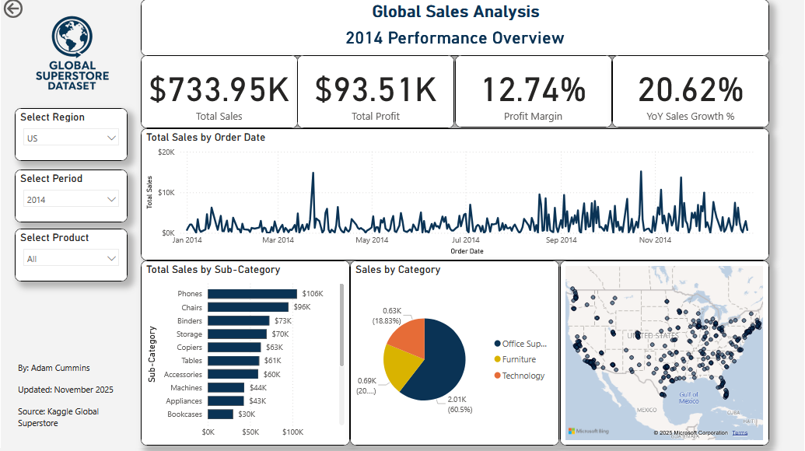
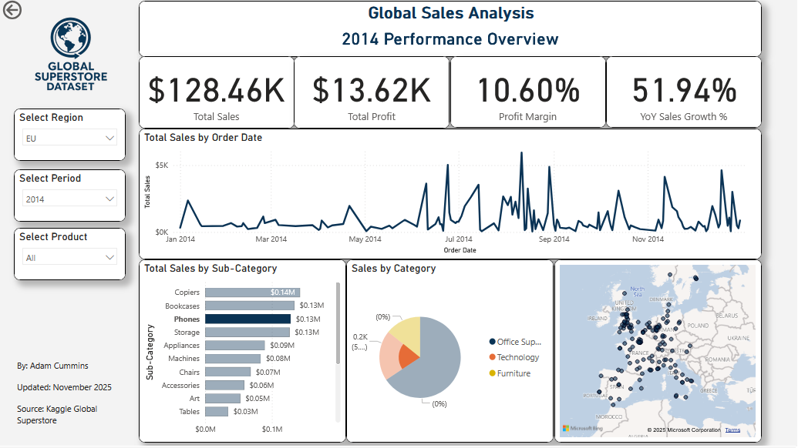
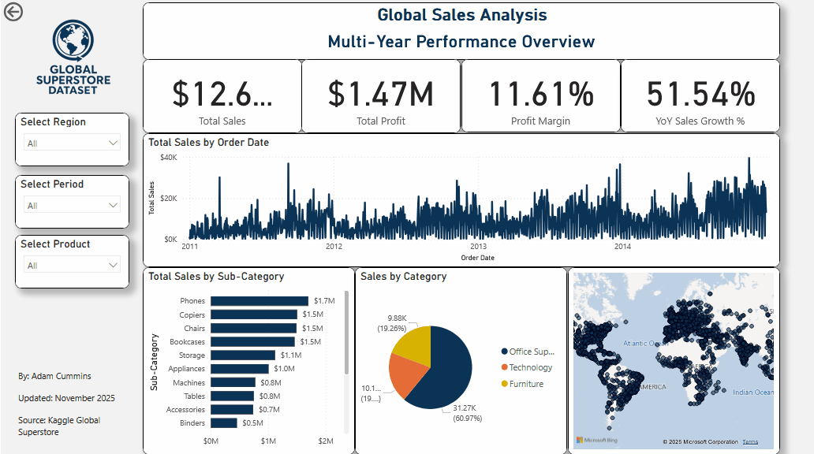

# Global Sales Analysis Dashboard

A comprehensive Power BI dashboard analyzing multi-year sales performance from the Kaggle Global Superstore Dataset. This project demonstrates advanced data visualization, DAX calculations, and business intelligence storytelling.


## Project Overview

This interactive dashboard provides executive-level insights into global sales performance across 2011-2014, enabling stakeholders to:
- Track key performance indicators (KPIs) including sales, profit, and growth metrics
- Analyze sales trends across time periods and geographic regions
- Identify top-performing products and categories
- Make data-driven decisions through interactive filtering


## Key Features

### Interactive Visualizations
- **Dynamic KPI Cards**: Real-time metrics showing Total Sales, Total Profit, Profit Margin, and YoY Sales Growth
- **Temporal Analysis**: Multi-year sales trends visualized at daily/monthly granularity
- **Category Performance**: Comparative analysis across product categories and sub-categories
- **Geographic Insights**: Regional sales distribution with interactive filtering
- **Cross-Filtering**: All visuals respond dynamically to user-selected filters

### Advanced Analytics
- Year-over-Year growth calculations using DAX time intelligence
- Profit margin analysis across product categories
- Sub-category performance rankings
- Multi-dimensional filtering (Region, Period, Product)

---

## Technical Skills Demonstrated

### Power BI Capabilities
- **Data Modeling**: Established relationships between fact and dimension tables
- **DAX Measures**: Created custom calculations for KPIs and time intelligence
- **Interactive Design**: Implemented slicers, cross-filtering, and dynamic titles
- **Visual Best Practices**: Applied data visualization principles for clarity and impact



### DAX Measures Created
```dax
// Dynamic Title
Dynamic Title = 
VAR CurrentYear = SELECTEDVALUE('Date Table'[Year], "Multi-Year")
VAR CurrentQuarter = 
    IF(
        ISFILTERED('Date Table'[Quarter]), 
        CONCATENATEX(VALUES('Date Table'[Quarter]), 'Date Table'[Quarter], ", ") & " ", 
        "" 
    )

RETURN
    CurrentQuarter & CurrentYear & " Performance Overview"

// Year-over-Year Sales Growth
YoY Sales Growth % = 
VAR CurrentYearSales = [Total Sales]
VAR PreviousYearSales = 
    CALCULATE(
        [Total Sales],
        SAMEPERIODLASTYEAR('Date Table'[Date]))
        VAR Result = DIVIDE(CurrentSales - PreviousYearSales, PreviousYearSales
    )

RETURN
    // If the result is blank (e.g., no prior year), return 0.
    IF(ISBLANK(Result), 0, Result)

// Profit Margin
Profit Margin % = 
    DIVIDE([Total Profit], [Total Sales], 0)

// Total Sales
Total Sales = SUM(Orders[Sales])

// Total Profit
Total Profit = SUM(Orders[Profit])
```

## Data Source

**Dataset**: [Global Superstore Dataset](https://www.kaggle.com/datasets/apoorvaappz/global-super-store-dataset) from Kaggle

**Data Characteristics**:
- **Time Period**: 2011-2014 (4 years)
- **Records**: 50,000+ transactions
- **Dimensions**: Geography, Products, Customers, Time
- **Metrics**: Sales, Profit, Quantity, Discount, Shipping Cost


## How to Use

### Prerequisites
- Power BI Desktop (Free version available from Microsoft)
- Windows 10/11 or Power BI Report Server

### Installation Steps
1. Clone this repository:
   ```bash
   git clone https://github.com/A-Cummins528/Power-BI-Global-Sales-Analysis-Dashboard.git
   ```

2. Download the dataset from Kaggle (link above) or use the included data file

3. Open `SalesAnalysis.pbix` in Power BI Desktop

4. If prompted, update the data source path to your local dataset location

5. Refresh the data: Home → Refresh

### Interacting with the Dashboard
- **Filter by Region**: Use the dropdown to focus on specific geographic areas
- **Select Time Period**: Choose date ranges to analyze specific timeframes
- **Product Analysis**: Filter by category or sub-category to drill down
- **Cross-Filtering**: Click any visual element to filter all other visuals
- **Reset Filters**: Clear all selections to return to global view





## Future Enhancements

### Planned Features
- [ ] Predictive forecasting using Power BI's analytics features
- [ ] Drill-through pages for regional deep-dives
- [ ] Shipping performance and logistics analysis
- [ ] Customer lifetime value calculations
- [ ] Mobile-optimized layout

### Technical Improvements
- [ ] Create parameter-based "what-if" analysis
- [ ] Add bookmarks for different analytical views
- [ ] Develop custom tooltips with detailed metrics


## Skills & Technologies

**Business Intelligence**
- Data Modeling 
- KPI Development
- Business Analytics
- Data Storytelling

**Technical Stack**
- Microsoft Power BI Desktop
- DAX (Data Analysis Expressions)
- Data Visualization Best Practices



